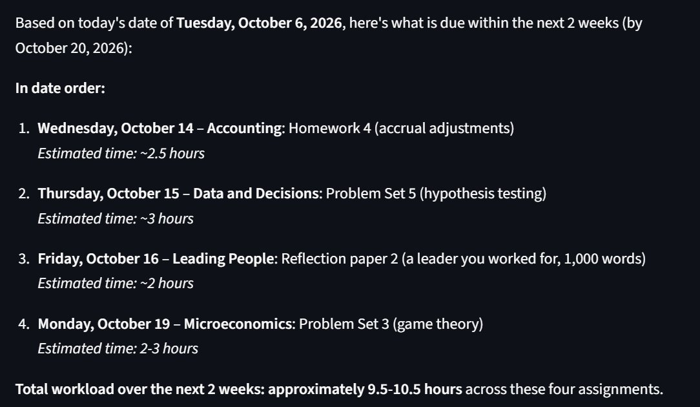
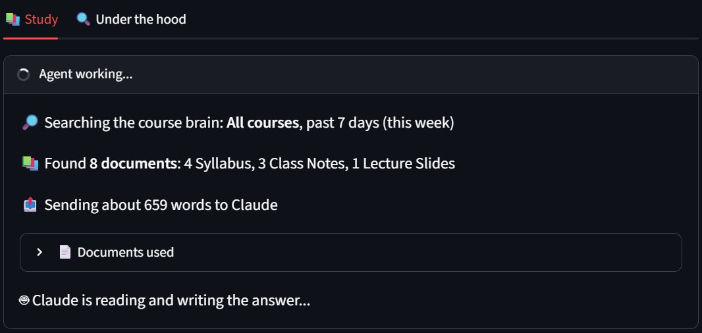
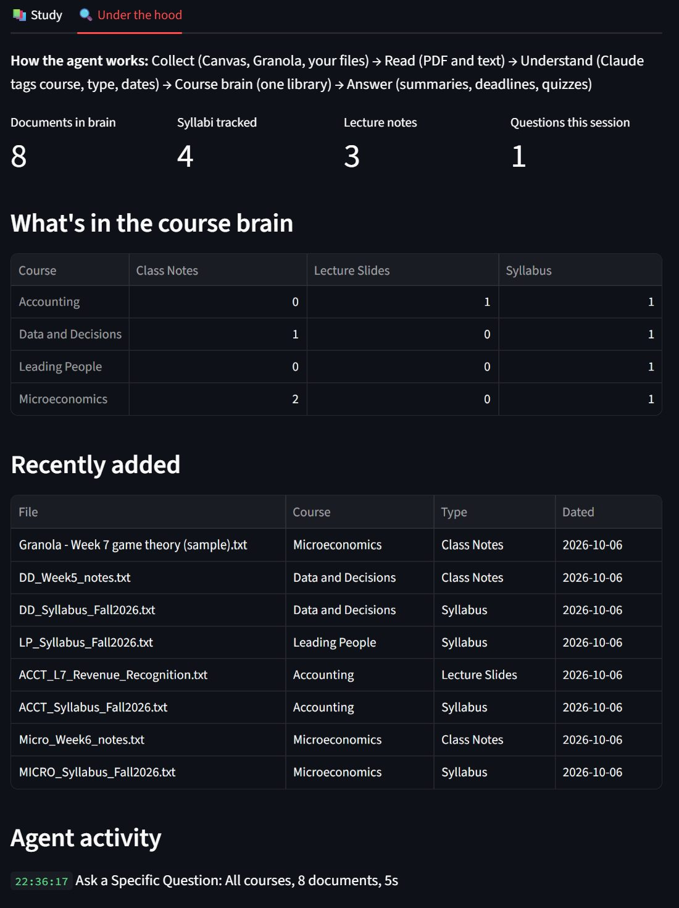

# Haas Study Agent

An AI study assistant for my MBA coursework. It pulls together syllabi, Canvas files, lecture slides, and Granola lecture notes from four courses into one "course brain," then answers what I need to know: what's due, how long it will take, and what I've learned so far.

**Live demo:** [study.chensational.dev](https://study.chensational.dev) (sample course material, for privacy)
**Project page:** [chensational.dev](https://chensational.dev/#haas-agent)

## The problem

MBA coursework is scattered. Each course has its own syllabus, deadlines, pre-readings, and exam dates, plus slides on Canvas and lecture transcripts in Granola. Keeping track of all of it meant missing about one deadline a week and spending around 3 hours a week just pulling material together before I could study.

## What it does

- **Answers questions across all courses at once:** "What's due in the next two weeks, and how long will each take?" returns every deadline in date order, with the course and a time estimate for each.
- **Consolidates learning:** summaries of everything covered so far, per course or across all of them.
- **Quizzes me:** practice questions from my own material, graded by AI with feedback.
- **Shows its work:** every answer displays the agent's steps live (searching the course brain, documents found, what was sent to the AI), and an "Under the hood" tab shows what's in the course brain and everything the agent did.








## Results

- 0 missed deadlines this semester, down from about one a week
- Weekly prep time down from about 3 hours to 30 minutes

## How it works

```
Collect        Canvas files (API), downloaded files (folder watcher), Granola lecture notes
   |
Read           PDFs and text turned into plain text (pdfplumber)
   |
Understand     Claude tags each file by course and type: syllabus, slides, reading, assignment, notes
   |
Course brain   One searchable library with dates (SQLite)
   |
Answer         Deadlines, time estimates, summaries, AI-graded quizzes (Streamlit + Claude)
```

When there's too much material for one question, the agent keeps every syllabus and then picks the most relevant notes, so answers stay fast and deadlines are never dropped.

## Tech stack

| Tool | What it does here |
|---|---|
| Claude API | Classifies files, extracts deadlines, estimates time, writes summaries, grades answers |
| Canvas API | Pulls new course files automatically |
| watchdog | Picks up files downloaded by hand, for courses where Canvas file access is off |
| pdfplumber | Extracts text from slides, syllabi, and readings |
| SQLite | The course brain |
| Streamlit | The web app |
| Railway | Hosts the always-on public demo with permanent storage |

## Product decisions

- **Answer questions, don't just store files.** The value is asking "what's due?", not browsing folders.
- **Plan by effort, not just date.** A 3-hour problem set due Friday outranks a 20-minute reading due Thursday.
- **Date notes by lecture, not upload.** Notes pasted days later still land in the right week.
- **Never cut the source short.** An early version trimmed long files and silently lost a syllabus's exam dates; the agent now always keeps full syllabi.
- **Public demo uses sample data.** Real course files and classmates' comments stay private; the public version hides Canvas sync, and notes pasted by visitors stay in their own session.

## Run it locally

1. `pip install -r requirements.txt`
2. Create a `.env` file with `ANTHROPIC_API_KEY`, `CANVAS_API_TOKEN`, and `CANVAS_BASE_URL`
3. `streamlit run app.py`

To run the public demo version, set `DEMO_MODE=1` and `DATA_DIR` to a persistent folder.

Built by [Bryan Chen](https://chensational.dev), Haas MBA '28.
